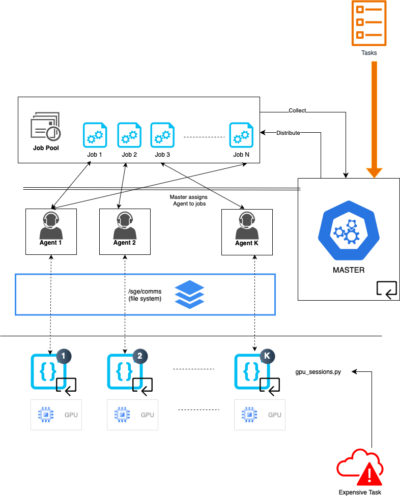

# Parallel GPU Processing template

Simple low-level program template to distribute tasks on GPUs using the Sun Grid Engine paradigm. The example use case is a pytorch tensor multiplication with copying data to GPU and perfoming operations on it.

## Workflow

  

1. Running `python gpu_session.py gpu_id base_folder` opens a python session, locks GPU `gpu_id` to that session, and listens for job in `base_folder\agent_pool\{gpu_id}.POOL`. 
    - Do this for as many GPUs (in different terminal or tmux sessions) or 
    - For convenience, running `start_agent.sh n_gpu base_folder` creates the communication folders in `base_folder` and fires up `n_gpu` python session, each locking a GPU. This can be run directly from `main.py` by setting HOT_START = FALSE

2. Running `main.py` will feed the tasks to the Master, which will distribute it to the JobPool. Master periodically checks for available agents, distribute jobs to agents and collect results from completed jobs. 

## Usage
This template can be used to distribute tasks on GPU, as part of a bigger computationally intensive program. In a typical use case, 
1. The first step is to up `expensive_task.py` and ensure GPU usage in the expensive function (for example in pytorch, this is done via `.to(device)` where device is of type cuda). 
2. Set up the tasks in main.py, this is a list of arguments/data passed to `expensive_task`. 
    - Some minor configuration will be required in the `Job` object in `jobs.py` to set the way the data should be passed. 
    - In the current example, it is written to a `.npz` file when `Agent` calls `job.deploy()`, and it is loaded by the `gpu_session.py` to which it is assigned. 
3. In case all jobs need to access shared data, this is passed in the shared data argument. At the moment, even an empty piece of data should be passed because `Agent` communicates that it has a job pending by populating `agent_pool/{agent_id}.POOL` with the location of the shared data (TODO needs to be fixed/auto-generated)
4. In a separate terminal, run `watch -n 1 nvidia-smi` to observe usage of every GPU unit requested.

# Project TODOs

### GPU Management
- [!!!] Lock GPU in gpu_session.py to prevent other processes from using it

### Agent Management
- [!!!] Need shared data path to populate agents (agent.py)
- [!!] Put new agents directly in available agents (master.py)
- [!] Shared data is needed (even an empty matrix) to let agents properly display status to master (main.py)
- load data directly on GPU

### Job Processing
- [!] Implement result handling in jobs.py (e.g., pass to JobPool or collect files)
- [!] Consolidate logging to a single file
